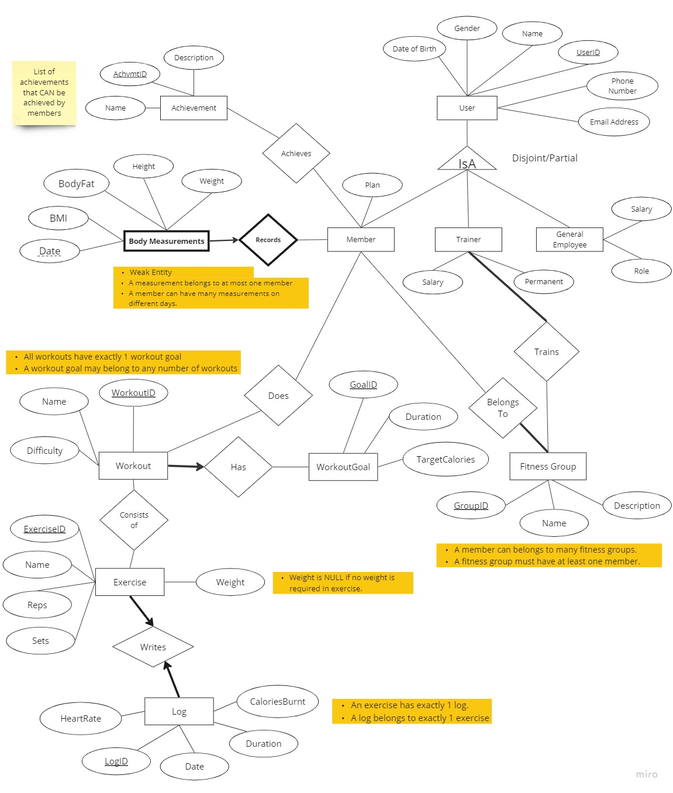
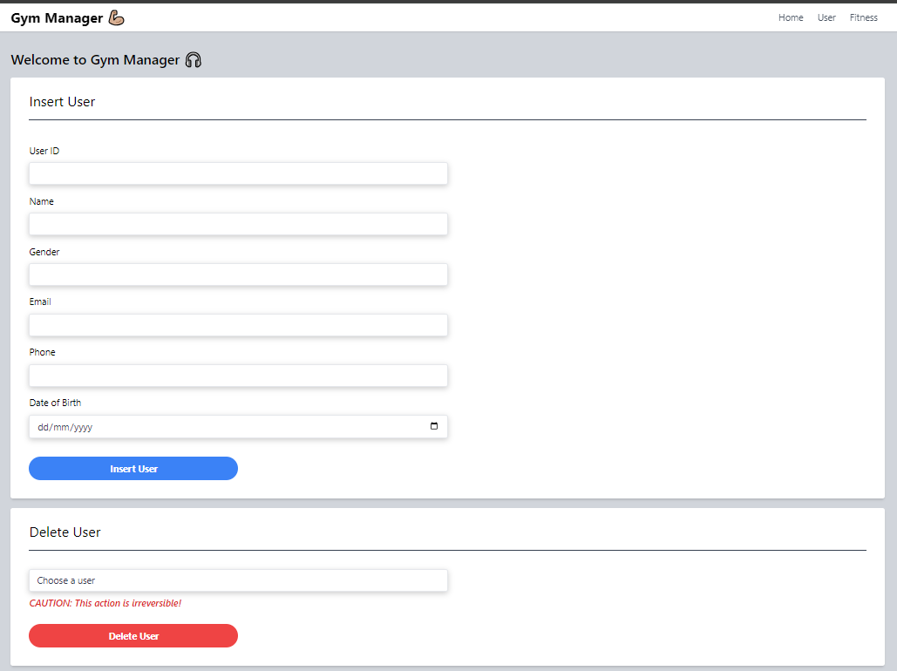
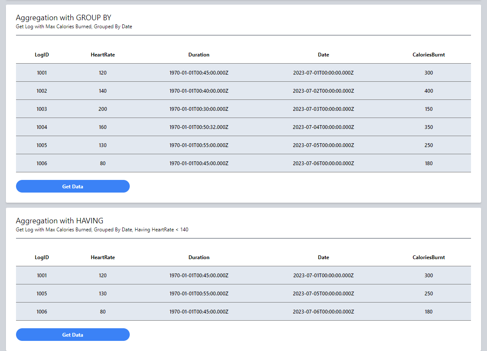

# Gym Manager :muscle:

## Description 

Our application is designed to help gym organizations to effectively and efficiently manage their data. With the help of an interactive GUI and a rigid database, users of our application will be able to seamlessly coordinate with their data management.

The project will track, store, and analyze data recorded during exercises to present insightful findings. With the help of logically organized data stored in our database, we will be able to benefit our users by assisting them in data management, tracking, data analytics, progress monitoring, and much more.

Using the database application, users will be able to seamlessly access their personal information, exercise logs, and learn more about their exercise routine through body measurements such as average heart rate, calories burnt per hour, resting heart rate and other essential statistics.

## Tech Stack 💻

-   ReactJS (FrontEnd)
-   SQL Server Management Studio + Microsoft SQL Server Express (Database Layer)
-   SQL (BackEnd)
-   Tailwind CSS (Styling, FrontEnd)

> To download SQL Server Management Studio: https://learn.microsoft.com/en-us/sql/ssms/download-sql-server-management-studio-ssms?view=sql-server-ver16#download-ssms
>
> To download Microsoft SQL Server Express: https://www.microsoft.com/en-us/sql-server/sql-server-downloads

## Features ⚒️

-   User Management
-   Workout Tracking
-   Body Measurements Tracking
-   Fitness Group Management
-   Achievements and Rewards
-   Goal Setting and Tracking
-   Exercise Library

## Project Setup ⚒️

### Frontend

-   `cd src/client`
-   `npm i`
-   `npm run start`
-   Locally served on [http://localhost:3000](http://localhost:3000/)

### Backend

-   Open new terminal
-   `cd src/server`
-   `npm i`
-   `npm run server`
-   Locally served on [http://localhost:8080](http://localhost:8080/)

### Database Setup

-   Microsoft SQL Instructions:
    -   Right Click Server and go to Properties -> Security -> Server Authentication and change it to SQL "Server and Windows authentication mode"
    -   Under Security -> Logins
        -   right click and create new login
            Give it name and password in the src\dbFiles\dbConfig.js file
        -   uncheck Enforce password security
        -   Under user mapping, check your database and db_owner
    -   press Wind + R and run compmgmt.msc
    -   Under Protocols For SQL Express -> TCP/IP -> properties -> ip addresses -> IP_ALL, change TCP to port 1433
        -   Can also change port for IP 127.0.0.1 (localhost) to 1433 for redundancy.
    -   Go to Services, and find SQLEXPRESS and restart it
    -   Also under Services, ensure the SQL Server Browser is Enabled on port 1433 and any other active SQL server is not on port 1433.
- To fill database with pre-made data go to `data-reset/Database Reset File.sql` and copy paste those queries into MS SQL

## Entity Relationship Diagram

## Sample UI Photos

